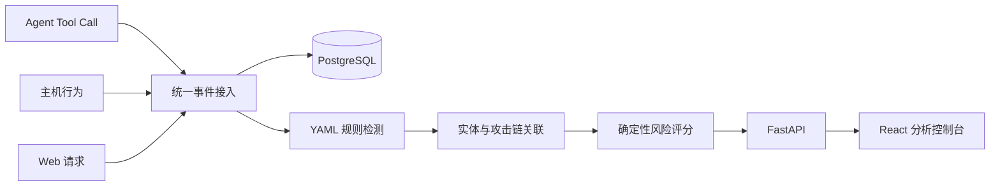
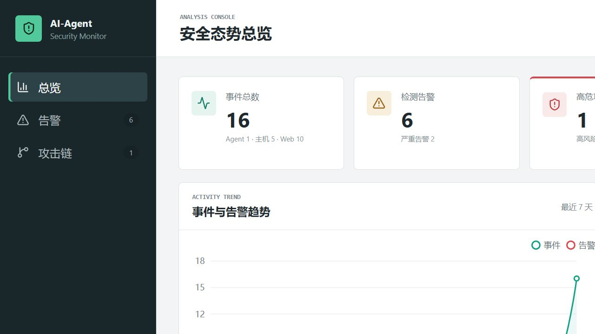
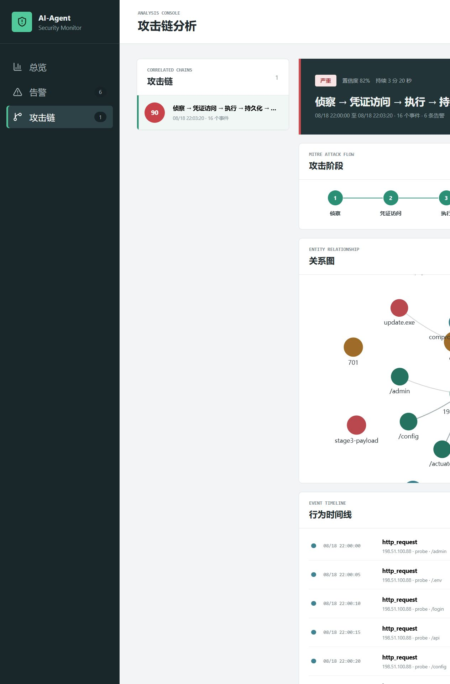

# AI-Agent Security Monitor

AI Agent、主机和 Web 行为的统一检测与风险分析平台。当前完成阶段 8：生产部署、管理员认证与受控采集器接入。

## 架构



平台以统一事件模型作为模块边界，检测、关联和评分均为确定性逻辑；前端只消费 API，不硬编码演示结果。

## 演示截图





## 当前能力

- FastAPI 健康检查：`GET /health`
- 统一事件单条/批量写入：`POST /api/events`
- 事件查询与时间、来源、类型、`trace_id` 过滤：`GET /api/events`
- 基于 `event_id` 的幂等去重
- YAML 驱动的字段匹配、分组计数、去重计数和时间窗口序列检测
- 首批五条检测规则：Agent 高频调用、Web 多路径探测、认证失败后成功、解释器启动下载工具、文件落地后启动进程
- 可解释告警查询：`GET /api/alerts`，包含证据事件、时间范围和 MITRE 技术编号
- 按父事件、会话、PID/PPID、文件哈希、IP 和主体时间近邻关联攻击行为
- Agent、用户、进程、文件、IP、域名和会话实体图，以及调用、创建、写入、执行、连接和派生关系
- 攻击链列表与详情：`GET /api/chains`、`GET /api/chains/{id}`，节点可追溯到原始事件
- 六个攻击阶段：侦察、凭证访问、执行、持久化、横向和外联
- 确定性的 0–100 风险评分，包含告警严重度、攻击链完整度、资产重要度、自动化强度和关联置信度
- 低、中、高、严重四级风险，以及分项贡献、加分原因、证据事件和建议处置
- YAML 资产重要度配置，便于在接入 CMDB 前维护关键身份、Agent、主机和地址
- 分析控制台总览：事件、告警、高危链、来源分布和 7 天趋势
- 告警工作台：按等级、规则、来源和时间范围筛选，并查看检测证据
- 攻击链分析：MITRE 阶段、实体关系图、事件时间线和原始事件抽屉
- 链节点详情：关联原因、评分分项、证据事件和处置建议
- 控制台加载、空数据、错误状态和移动端响应式布局
- PostgreSQL 16、SQLAlchemy 2 和 Alembic 迁移骨架
- React + TypeScript + ECharts 分析控制台
- Docker Compose 一键启动
- 按事件时间顺序回放的正常运维与 AI 自动攻击场景
- 一键启动、场景验收、攻击链 JSON 导出和数据卷清理
- Pytest 与 Vitest 基础测试
- 单管理员 PBKDF2 密码认证与短期 HMAC 会话令牌
- 短期、限次的采集器注册令牌与每采集器独立 API Key
- 采集器凭据只保存哈希与指纹，注册结果中的明文 Key 只返回一次
- 受保护的采集器批量上报与心跳接口，服务端绑定主机/采集器身份
- 上报请求体、批量数量、时间戳偏差和每凭据速率限制
- 登录、注册、凭据拒绝、限流及管理员操作审计

## 一键演示

环境要求：Docker Desktop 或 Docker Engine（含 Compose 插件）。

从纯净数据开始运行 AI 自动攻击场景：

```bash
python demo/clean.py
python demo/run_demo.py ai_attack
```

脚本会构建并启动服务、等待控制台可用、按事件时间顺序回放样本，并验证至少产生一条高风险链。攻击链详情同时写入 `demo/output/ai_attack_chains.json`。

预期结果：16 个事件、6 条告警、1 条攻击链；链覆盖侦察、凭据访问、执行、持久化、横向和外联六阶段，风险分数 90（严重），关联置信度 82%。

随后访问：

- 控制台：http://localhost:3000
- API：http://localhost:8000/health
- OpenAPI：http://localhost:8000/docs

回放正常运维对照样本：

```bash
python demo/clean.py
python demo/run_demo.py normal_ops
```

预期结果：6 个事件、0 条告警、0 条高危攻击链。`--skip-build` 可复用现有镜像，`--delay 0.5` 可按固定墙钟间隔慢速演示。

如果服务已启动，也可只运行通用回放器：

```bash
python demo/replay.py demo/ai_attack.jsonl --output demo/output/chains.json
```

固定事件 ID 使重复回放保持幂等。回放器会校验 JSONL、按带时区的时间戳排序并逐条发送事件。示例链见 `demo/example_attack_chain.json`，完整分析见 `docs/EXAMPLE_RISK_REPORT.md`。

清理命令会停止本项目 Compose 服务并删除本地 PostgreSQL 数据卷：

```bash
python demo/clean.py
```

## 快速启动

仅启动平台而不回放数据：

```bash
docker compose up --build
curl http://localhost:8000/health
```

上报一条 Agent Tool Call 示例：

```bash
python collectors/agent_tool_call.py
```

查询事件：

```bash
curl "http://localhost:8000/api/events?source=agent&event_type=tool_call&trace_id=demo-session-01"
```

`POST /api/events` 接受一个事件对象或事件对象数组（每批最多 1000 条）。查询接口还支持 `start_time`、`end_time`、`limit` 和 `offset`；时间使用带时区的 ISO 8601 格式。

控制台总览数据来自聚合接口：

```bash
curl "http://localhost:8000/api/overview?days=7"
```

回放早期阶段样本并查询告警：

```bash
python demo/replay.py demo/events-stage2.jsonl
curl "http://localhost:8000/api/alerts?severity=critical"
```

告警接口支持 `rule_id`、`severity`、`source`、`start_time`、`end_time`、`limit` 和 `offset` 过滤，并返回证据事件涉及的数据来源。规则位于 `rules/*.yaml`；每条规则包含 `id`、`name`、`conditions`、`window`、`threshold`、`severity` 和 `mitre`。修改规则后需重启后端进程。

回放早期阶段完整攻击链并查看详情：

```bash
python demo/replay.py demo/events-stage3.jsonl
curl "http://localhost:8000/api/chains"
curl "http://localhost:8000/api/chains/<chain-id>"
```

攻击链列表支持 `stage`、`min_confidence`、`limit` 和 `offset` 过滤。详情返回实体节点、带关联原因和置信度的关系边，以及按时间排序的完整原始事件。

列表与详情中的 `risk` 字段均返回总分、等级和完整解释。评分公式为：

```text
告警严重度 × 0.30 + 攻击链完整度 × 0.25 + 资产重要度 × 0.20
+ 自动化强度 × 0.15 + 关联置信度 × 0.10
```

资产重要度维护在 `assets.yaml`。修改规则或资产配置后需重启后端；再次回放已有事件会重建攻击链并刷新风险评分。

停止服务：

```bash
docker compose down
```

如需同时删除本地数据库卷：

```bash
docker compose down -v
```

## 腾讯云 Linux 部署

阶段七的生产拓扑使用 Ubuntu 22.04 LTS（最低 2 vCPU、4 GB RAM、40 GB 云硬盘）和 Docker Engine + Compose 插件。生产 Compose 文件不会把 PostgreSQL、FastAPI 或前端端口发布到宿主机，只由 Nginx 反向代理对外提供 80/443；80 仅跳转到 HTTPS。

### 服务器初始化

使用非 root 管理员账户并通过 SSH 密钥登录，随后安装 Docker、启用防火墙和时间同步。腾讯云安全组与系统防火墙只允许可信管理员 IP 访问 SSH，以及公开访问 80/443：

```bash
sudo apt update && sudo apt upgrade -y
sudo apt install -y ca-certificates curl git jq openssl age ufw chrony
curl -fsSL https://get.docker.com | sudo sh
sudo usermod -aG docker "$USER"
sudo systemctl enable --now docker chrony
sudo ufw default deny incoming
sudo ufw default allow outgoing
sudo ufw allow from <管理员可信IP>/32 to any port 22 proto tcp
sudo ufw allow 80/tcp
sudo ufw allow 443/tcp
sudo ufw --force enable
```

不要开放 5432、8000 或 3000。部署账户应拥有项目目录，TLS 私钥由 root 或证书管理器维护，权限设为 `600`。

### DNS 与 TLS

将域名 A/AAAA 记录指向服务器，在服务器上准备受信任证书（例如 Certbot/Let's Encrypt 生成的 `fullchain.pem` 和 `privkey.pem`）。开发验证可以使用自签证书，但浏览器会显示警告，且不得把跳过校验作为正式配置。证书续期后重载代理：

```bash
sudo chmod 600 /etc/letsencrypt/live/<域名>/privkey.pem
sudo docker compose --env-file .env.production -f compose.production.yaml exec proxy nginx -s reload
```

### 首次部署

```bash
git clone <仓库地址> ai-agent-security-monitor
cd ai-agent-security-monitor
cp .env.production.example .env.production
openssl rand -hex 32  # 将结果填入 POSTGRES_PASSWORD，并同步 DATABASE_URL 中的密码
python3 scripts/hash-admin-password.py  # 将结果用单引号填入 ADMIN_PASSWORD_HASH
openssl rand -hex 32  # 将结果填入 ADMIN_SESSION_SECRET
chmod 600 .env.production
# 编辑 DOMAIN、证书、数据库、管理员与 CORS 变量
bash scripts/deploy.sh
curl --fail https://<域名>/health
```

脚本会拒绝占位符密钥，校验证书可读性，检查 Compose 配置，构建镜像，等待数据库健康后执行 `alembic upgrade head`，启动所有服务并轮询 HTTPS 健康检查。迁移在生产启动前执行，失败时不会宣称部署成功。

### 升级与回滚

升级前先做加密备份，再切换到已审核的版本并重新运行部署脚本：

```bash
export AGE_RECIPIENT='age1...'
bash scripts/backup-postgres.sh
git fetch --tags
git checkout <已审核版本>
bash scripts/deploy.sh
docker compose --env-file .env.production -f compose.production.yaml ps
```

应用镜像和配置回滚到上一版本时，切回对应提交后再次运行 `deploy.sh`。数据库迁移若包含不可逆变更，必须先在隔离环境恢复备份并按迁移说明处理，不能只回滚镜像。

### 加密备份与恢复

备份脚本要求安装 `age` 和 `AGE_RECIPIENT`，默认写入权限为 `700` 的 `backups/`，文件为 `600`，保留 14 天；备份内容不进入 Git。恢复必须在隔离环境验证，确认事件数后再用于生产：

```bash
age --decrypt -i /secure/age-key.txt backups/security-monitor-<时间>.dump.age > /tmp/security-monitor.dump
docker compose --env-file .env.production -f compose.production.yaml stop backend
docker compose --env-file .env.production -f compose.production.yaml exec -T db pg_restore \
  --clean --if-exists --no-owner --no-privileges -d security_monitor < /tmp/security-monitor.dump
docker compose --env-file .env.production -f compose.production.yaml up -d backend
```

若修改了 `POSTGRES_DB`，将恢复命令中的 `security_monitor` 替换为实际数据库名。

恢复前确认目标数据库和备份来源，恢复后检查 `https://<域名>/health`、事件查询和告警数量；完成后立即删除临时明文 dump，并保管好 age 私钥。定期在独立环境演练恢复，记录备份时间、事件数量和校验结果。

### 故障排查

```bash
docker compose --env-file .env.production -f compose.production.yaml ps
docker compose --env-file .env.production -f compose.production.yaml logs --tail=100 proxy backend db
curl --insecure --verbose https://127.0.0.1/health
```

若代理无法启动，先检查证书路径和权限；若后端不健康，检查数据库健康状态、`DATABASE_URL` 与迁移日志。主机重启后所有服务应由 `restart: unless-stopped` 自动恢复，PostgreSQL 数据保存在 `postgres_data` 卷中。

## 身份认证与采集器接入

生产模板设置 `AUTH_REQUIRED=true`。此时除 `/health`、`/api/auth/login` 和采集器注册外，事件、告警、攻击链、总览和管理员接口都要求管理员 Bearer 令牌；原有匿名 `POST /api/events` 返回 `401`。本地 `.env.example` 保持 `AUTH_REQUIRED=false`，便于继续运行阶段六演示，不能用于生产。

登录并创建一个 30 分钟内有效、仅可使用一次的注册令牌：

```bash
ADMIN_TOKEN="$(curl --fail -sS https://<域名>/api/auth/login \
  -H 'Content-Type: application/json' \
  -d '{"username":"<管理员>","password":"<密码>"}' | jq -r .access_token)"

ENROLLMENT_TOKEN="$(curl --fail -sS https://<域名>/api/admin/enrollment-tokens \
  -H "Authorization: Bearer $ADMIN_TOKEN" \
  -H 'Content-Type: application/json' \
  -d '{"expires_in_minutes":30,"max_uses":1}' | jq -r .enrollment_token)"
```

注册接口为 `POST /api/collectors/enroll`，需要提交该令牌以及稳定 `host_id`、主机名、系统版本和采集器版本。响应中的 `api_key` 只显示一次；平台只保存 SHA-256 哈希和短指纹。采集器后续以 `X-Collector-API-Key` 调用：

- `POST /api/collector/events`：只接受 `source=host` 的事件数组；生产默认每批最多 500 条、2 MB、时间与服务器相差不超过 15 分钟。
- `POST /api/collector/heartbeat`：更新采集器和主机最后在线时间。

事件中的 `attributes.host_id` 和 `attributes.collector_id` 由服务端根据凭据覆盖，客户端不能冒充其他主机。成功响应可从本地队列删除对应事件；`429` 按 `Retry-After` 重试，网络错误和 `5xx` 采用退避重试，`401`、`403`、`413` 和 `422` 应停止重试并修正凭据或负载。重复发送相同 `event_id` 保持幂等。

管理员可通过 `POST /api/admin/collectors/{collector_id}/credentials/rotate` 轮换凭据；旧 Key 立即失效，新 Key 同样只返回一次。`POST /api/admin/collectors/{collector_id}/disable` 可禁用采集器，之后其请求返回 `403`。

管理员可查询最近审计记录：

```bash
curl --fail -sS https://<域名>/api/admin/audit-logs \
  -H "Authorization: Bearer $ADMIN_TOKEN"
```

审计详情不记录密码、注册令牌或 API Key。生产 CORS 使用 `.env.production` 中的 JSON 域名列表，例如 `["https://monitor.example.com"]`，不得配置通配符与凭据组合。

## 检测规则

规则位于 `rules/stage2.yaml`，采用字段匹配、分组计数、去重计数和有序序列两类检测方式：

| 规则 | 触发条件 | 严重度 | MITRE |
|---|---|---|---|
| Agent 高频 Tool Call | 同一 Agent/Trace 1 分钟内 8 次调用 | 高 | T1059 |
| 短时间多路径探测 | 同一来源 1 分钟内探测 6 个不同路径 | 高 | T1595.002 |
| 认证失败后成功 | 5 分钟内 3 次失败后成功 | 严重 | T1110 |
| 解释器启动下载工具 | Shell 启动 curl/wget 等下载工具 | 严重 | T1059、T1105 |
| 文件落地后创建进程 | 同一 Trace 2 分钟内写文件后启动进程 | 高 | T1105、T1204.002 |

每条告警包含规则 ID、严重度、时间范围、MITRE 编号和证据事件 ID。修改规则后需重启后端。

## 设计取舍

- **确定性优先**：规则、关联和评分可追溯、可重复，不让大模型直接决定风险。
- **MVP 保持精简**：PostgreSQL 同时承载事件和实体关系，暂不引入 Kafka、Neo4j 或机器学习。
- **同步重建攻击链**：数据规模较小时实现简单且结果一致；规模增大后应改为异步增量计算。
- **固定演示时间与 UUID**：便于幂等回放和结果对比，但生产采集器应生成真实 UTC 时间和全局唯一 ID。
- **配置化资产重要度**：`assets.yaml` 足以支持演示，生产环境应接入 CMDB 并建立配置变更审计。

## 本地开发

### 后端

Python 3.12：

```bash
cd backend
python -m venv .venv
.venv\Scripts\Activate.ps1
pip install -e ".[dev]"
copy ..\.env.example ..\.env
alembic upgrade head
uvicorn app.main:app --reload
```

运行测试：

```bash
cd backend
pytest
```

### 前端

Node.js 20+：

```bash
cd frontend
npm install
npm run dev
```

Vite 开发服务器会将 `/api` 请求代理到 `http://127.0.0.1:8000`。

运行测试与构建：

```bash
cd frontend
npm test -- --run
npm run build
```

## 数据库迁移

后端容器启动时自动执行：

```bash
alembic upgrade head
```

创建新迁移：

```bash
cd backend
alembic revision --autogenerate -m "describe change"
```

## 目录

```text
backend/       FastAPI、SQLAlchemy、Alembic 与测试
frontend/      React、TypeScript、Vite 与 Vitest
collectors/    Agent Tool Call 上报示例及后续采集器
rules/         YAML 检测规则
assets.yaml    资产重要度配置
demo/          两类演示数据、回放器、一键演示、清理脚本和示例链
docs/          施工文档
```
