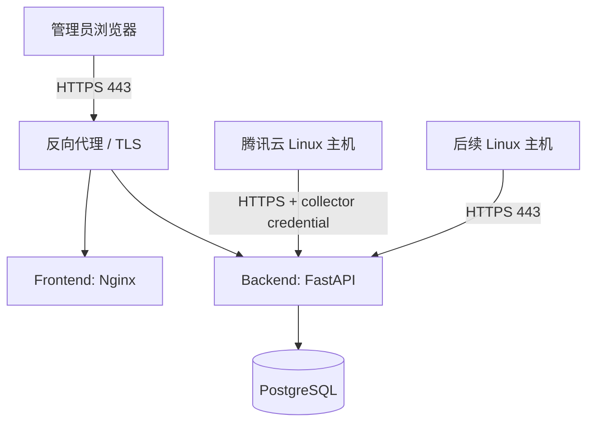

# AI-Agent Security Monitor 施工文档 v0.1.1

## 1. 版本目标

v0.1.0 已完成演示闭环：样本事件经过统一接入、规则检测、攻击链关联、风险评分和控制台展示后，可以稳定复现结果。

v0.1.1 的目标是把项目从“可回放演示”推进为“可在一台真实 Linux 服务器上运行和观测”的安全 MVP。首个部署目标为一台腾讯云 Linux 云服务器；该服务器同时承载平台服务，并作为第一个受监控端点。

本版本完成后，应能验证以下闭环：

```text
腾讯云 Linux 主机上的真实行为
  -> Host Collector
  -> 受鉴权的 HTTPS 事件接入
  -> PostgreSQL / 规则检测 / 攻击链
  -> 控制台中的主机、事件、告警和处置证据
```

### 1.1 本版本验收范围

- 平台可通过 Docker Compose 部署在腾讯云 Linux 云服务器。
- 数据库不暴露到公网；控制台和 API 通过 HTTPS 对外提供服务。
- 平台具备管理员访问控制和采集器身份鉴别，不能匿名写入事件。
- 一台 Linux 主机可安装并运行采集器，采集真实的进程启动、文件写入、网络连接和认证事件。
- 采集器断网或平台重启时可在本地缓存并重试，不静默丢弃事件。
- 控制台可管理并查看已接入主机的在线状态、最后上报时间和相关事件/告警。
- 在隔离的测试目录执行受控行为后，能从真实遥测中生成至少一条可追溯告警或攻击链。

### 1.2 非目标

- 不在本版本同时支持 Windows、macOS 和 Linux；首版仅支持 Linux。
- 不直接采集完整 Prompt、口令、Cookie、API Key 或文件正文。
- 不引入 Kafka、Neo4j、SIEM 联动或机器学习模型。
- 不承诺高可用、跨地域容灾、多租户或海量日志分析。
- 不在生产服务器上执行真实攻击、横向移动或破坏性测试。

## 2. 部署与安全基线

### 2.1 推荐部署拓扑

首版采用单机部署，组件均运行于同一台腾讯云 Linux 云服务器：



- `frontend`、`backend` 和 `db` 延续现有 Compose 服务。
- 新增反向代理服务，统一监听 `80/443`；HTTP 仅用于跳转 HTTPS，业务流量使用 HTTPS。
- `backend` 与 `db` 仅加入 Docker 内部网络，不映射公网端口。
- 采集器以宿主机 `systemd` 服务运行，使用出站 HTTPS 上报。这样后续远程主机无需开放入站端口。
- 先让平台服务器本机安装采集器，验证链路后再接入第二台测试主机。

### 2.2 腾讯云与操作系统前置条件

- 使用受支持的 Linux 发行版，例如 Ubuntu 22.04 LTS 或 Rocky Linux 9；在文档和脚本中固定一种首发环境。
- 云服务器至少 2 vCPU、4 GB RAM、40 GB 云硬盘；数据量增加前监控 CPU、内存和磁盘使用率。
- 使用非 root 管理员账户登录，日常操作通过 `sudo`；禁用密码登录，使用 SSH 密钥。
- 腾讯云安全组只允许管理员可信 IP 访问 SSH `22`；仅在需要对外访问时开放 `80/443`。不开放 `5432`、`8000`、`3000`。
- 系统防火墙规则与安全组保持一致；定期安装安全更新并启用时间同步（NTP/chrony）。
- 绑定域名并配置 TLS 证书。开发验证可使用临时自签证书，但不得把“跳过证书校验”带入正式部署。

### 2.3 必须处理的机密

下列值仅保存在服务器的权限受限环境文件或密钥管理服务中，不写入 Git、镜像、截图和事件属性：

| 机密 | 用途 | 要求 |
|---|---|---|
| `POSTGRES_PASSWORD` | PostgreSQL 服务账户 | 使用随机强密码 |
| `DATABASE_URL` | 后端连接数据库 | 仅后端容器可读 |
| `ADMIN_*` 或外部身份配置 | 控制台管理员认证 | 不使用默认口令 |
| `COLLECTOR_ENROLLMENT_TOKEN` | 首次注册采集器 | 短期、一次性、可撤销 |
| `COLLECTOR_API_KEY` / 客户端证书 | 已注册采集器上报 | 每主机独立、可轮换 |
| TLS 私钥 | HTTPS 服务 | 文件权限最小化 |

部署环境文件应设置为仅部署账户可读，例如 `chmod 600 .env.production`；仓库仅维护去敏后的 `.env.example`。

## 3. 生产事件与资产模型扩展

现有统一事件模型保持主干字段不变。v0.1.1 为每一条主机事件补充可验证的来源上下文，避免把不同主机、容器或重装后的端点错误关联。

### 3.1 主机事件约定

主机采集器发送的 `attributes` 至少包含：

```json
{
  "host_id": "stable-machine-id-or-generated-uuid",
  "hostname": "vm-security-monitor-01",
  "os": "ubuntu",
  "os_version": "22.04",
  "collector_id": "uuid",
  "collector_version": "0.1.1",
  "pid": 1234,
  "ppid": 1000,
  "uid": 1000,
  "username": "ubuntu",
  "command_line": "redacted-or-allowlisted-command",
  "source_ip": "10.0.0.5",
  "destination_ip": "198.51.100.10",
  "destination_port": 443
}
```

- `host_id` 在注册时生成或由稳定机器标识派生；不要只使用会变化的主机名或私网 IP。
- 进程事件携带 `pid`、`ppid`、可执行文件路径和命令摘要；命令行须在采集端执行敏感值脱敏与长度截断。
- 文件事件携带路径、操作类型、大小和可选哈希；不得上报文件内容。
- 网络事件携带五元组中可获得的字段、协议和关联 PID；不得捕获应用载荷。
- 认证事件携带认证结果、账户标识、来源 IP 和认证方式；不得上报密码。
- 所有时间戳使用带时区的 UTC ISO 8601，采集器应记录采集时间与上报时间以诊断延迟。

### 3.2 新增数据对象

| 对象 | 关键字段 | 用途 |
|---|---|---|
| Host | `host_id`、名称、系统、IP、标签、重要度 | 已接入终端的资产档案 |
| Collector | `collector_id`、`host_id`、版本、状态、最后心跳 | 采集器身份与健康状态 |
| CollectorCredential | 指纹、状态、过期时间、轮换时间 | 每采集器独立凭据，不保存明文 Key |
| EnrollmentToken | 哈希、有效期、最大使用次数、状态 | 仅用于首次注册 |
| AlertCase | 状态、负责人、备注、处置时间 | 告警运营与人工闭环 |

数据库迁移须为这些对象创建索引，至少覆盖 `host_id`、`collector_id`、`last_seen_at`、事件时间和告警状态。

## 4. 迭代计划

## 阶段 7：腾讯云部署可用性

### 目标

将现有服务从本地 Docker Desktop 部署到腾讯云 Linux，并建立可重复、可回滚的生产部署流程。

### 施工

- 新增 `compose.production.yaml`：不再直接暴露 `backend:8000`、`frontend:80` 和 `db:5432` 到公网。
- 增加反向代理及 TLS 配置；前端 API 请求统一走同域 `/api`。
- 增加 `.env.production.example`，仅列出变量名和安全说明，不写真实值。
- 新增 `scripts/deploy.sh` 或等价受控部署脚本：检查环境变量、拉取或构建镜像、运行迁移、启动服务、等待健康检查。
- 新增 `scripts/backup-postgres.sh` 与恢复说明；备份文件加密后保存到受控位置，设置保留周期。
- 配置容器 `restart: unless-stopped`、日志轮转、健康检查和资源限制。
- 在 README 增加“腾讯云部署”章节：服务器初始化、DNS/TLS、部署、升级、回滚、备份与故障排查。

### 验收

- 从干净的 Linux 云主机可按文档完成部署。
- `https://<domain>/health` 返回健康结果；控制台在 HTTPS 下可访问。
- 宿主机之外无法访问 `5432`、`8000` 和 `3000`。
- 重启主机后服务自动恢复，数据库已有事件仍存在。
- 执行备份并在隔离环境恢复后，可查询到预期事件数。

### 建议提交

```bash
git commit -m "feat: add Tencent Cloud production deployment"
```

## 阶段 8：身份认证与受控事件接入

### 目标

禁止匿名访问和匿名写入，建立管理员与采集器两类身份边界。

### 施工

- 管理员控制台接入身份认证。MVP 可选受保护的单管理员账户或可信 OIDC 身份提供方；密码只存储强哈希。
- 将 API 分为管理员接口与采集器接口。采集器不允许读取所有事件、告警或其他主机资料。
- 新增采集器注册接口，例如 `POST /api/collectors/enroll`，仅接受短期 enrollment token。
- 注册成功后返回一次性的采集器凭据；数据库只保存凭据哈希和指纹。
- 新增受保护批量上报接口，例如 `POST /api/collector/events`；服务端从凭据确定 `collector_id` 和 `host_id`，忽略客户端伪造的身份字段。
- 为登录、注册、凭据拒绝、限流命中和管理员操作写入审计日志。
- 对上报接口设置请求体大小、批量事件数量、每凭据速率和时间戳允许偏差限制。
- 配置 CORS 白名单，只允许部署域名；不使用通配符与凭据组合。

### 验收

- 未认证的管理员请求返回 `401`，权限不足返回 `403`。
- 原有匿名 `POST /api/events` 在生产配置中不可用，或仅限本地开发环境。
- 无效、过期、吊销或属于其他主机的凭据不能写入事件。
- 同一事件批次重试仍保持 `event_id` 幂等；失败响应能指导采集器决定是否重试。
- API 与前端新增认证、鉴权、速率限制和审计测试。

### 建议提交

```bash
git commit -m "feat: secure collector enrollment and event ingestion"
```

## 阶段 9：Linux Host Collector v0.1

### 目标

交付首个可安装、可运维的 Linux 采集器，使腾讯云服务器自身产生真实主机遥测。

### 施工

- 在 `collectors/linux/` 建立独立采集器包、配置文件模板、安装脚本、卸载脚本和 systemd unit。
- 首发实现优先读取 Linux `auditd` 事件和认证日志；采集器不自行执行或注入被监控进程。以后再评估 eBPF、Falco 或 Tetragon。
- 支持以下最小事件集：
  - `process_start`：进程、父进程、用户、可执行文件、命令摘要；
  - `file_write`：受监控路径范围内的新建/修改/重命名；
  - `network_connect`：发起进程、目标地址、端口、协议；
  - 认证成功与失败：账户、来源 IP、方式、结果。
- 以 NDJSON 或 SQLite 实现磁盘持久化队列；配置大小上限、保留策略和满载告警。队列不能无限占用系统盘。
- 批量 HTTPS 上报，采用指数退避、抖动、超时和幂等 `event_id`；成功确认后才删除本地队列记录。
- 加入周期性心跳：版本、启动时间、队列深度、最近采集/上报时间、错误摘要。
- 采集器最小权限运行；仅对读取 audit 日志、认证日志或所需内核事件保留必要能力。安装文档说明所需权限及其原因。
- 增加采集端脱敏器：匹配密码、Token、Authorization、Cookie、私钥片段和超长参数；采用 `[REDACTED]` 替换并记录脱敏计数。

### 受控验证场景

仅在已批准的测试目录和测试账户中执行，避免下载或执行未知内容：

1. 使用测试用户在 `/tmp/aasm-test/` 创建一个文本文件。
2. 运行一个无害命令，例如 `sh -c 'echo test > /tmp/aasm-test/event.txt'`。
3. 对受控测试端点执行一次 HTTPS 连通性请求，或访问平台自己的健康检查接口。
4. 产生一次已知的错误认证尝试后，以测试账户正常登录。

### 验收

- 一条安装命令或安装包可在目标 Linux 发行版上部署采集器，并在重启后自动运行。
- 控制台/API 显示该主机在线，且最后心跳时间在预期窗口内更新。
- 四类真实事件均能在事件查询中看到正确的 `host_id` 和采集器身份。
- 人为断开到平台的网络连接后，事件进入本地队列；网络恢复后按顺序补传且不重复写入。
- 受控验证场景至少命中一个相关规则或形成包含真实事件的链；每个节点可追溯至原始事件。
- 采集器单元测试覆盖事件映射、脱敏、队列恢复和 HTTP 重试；集成测试使用本地模拟 API。

### 建议提交

```bash
git commit -m "feat: add Linux host collector"
```

## 阶段 10：资产与采集器运营界面

### 目标

让使用者清楚知道哪些真实端点已接入、是否健康，以及告警影响哪台机器。

### 施工

- 新增 Hosts 页面：主机名、主机 ID、系统、标签、重要度、在线状态、最后上报时间、采集器版本和事件量。
- 新增 Host 详情：近 24 小时事件、告警、攻击链、采集器健康、IP 变化和最近错误。
- 支持安全的主机标签和资产重要度编辑；所有变更写入审计日志。
- 新增采集器注册向导：生成短期 enrollment token，展示适用于 Linux 的安装命令；令牌只显示一次。
- 在告警与攻击链详情中明确展示关联主机，支持跳转主机详情。
- 在控制台增加接入健康指标：离线主机数、队列积压、未升级采集器数和最近接收失败数。

### 验收

- 新注册主机在首次心跳后自动出现在列表中。
- 主机离线超过配置阈值后在控制台有明确状态；恢复后状态自动更新。
- 从真实事件、告警和攻击链均可定位到对应主机。
- 管理员只能通过受保护界面创建注册令牌和查看采集器凭据状态。

### 建议提交

```bash
git commit -m "feat: add host and collector management"
```

## 阶段 11：规则运营与告警处置

### 目标

使真实环境中的检测结果可调优、可跟踪、可通知，避免演示规则直接造成持续误报。

### 施工

- 为规则增加启用状态、版本、标签、适用主机范围、白名单/例外条件和变更记录。
- 保留 YAML 规则作为源文件；通过受控发布流程导入，禁止控制台任意执行表达式。
- 增加告警状态：`new`、`acknowledged`、`in_progress`、`resolved`、`dismissed`；记录操作者、时间和原因。
- 首批基于真实 Linux 数据调整或新增规则：异常下载工具、可疑解释器子进程、敏感路径写入、认证失败后成功、异常外联。
- 增加至少一种出站通知渠道，例如 Webhook；签名、重试和失败状态可见，通知中不携带敏感命令参数。
- 建立误报反馈样本集，规则调整前后在演示数据和真实去敏样本上回归测试。

### 验收

- 对单主机禁用/启用规则不会影响其他主机。
- 告警状态变更有完整审计记录，且不会修改原始事件证据。
- Webhook 收到不含密钥和完整敏感数据的告警摘要。
- 调整规则后，现有演示回归和真实样本回归均通过。

### 建议提交

```bash
git commit -m "feat: add alert case workflow and notifications"
```

## 阶段 12：真实 AI Agent 与 Web 数据接入

### 目标

在主机遥测稳定后，将真实 Agent 和 Web 应用行为接入统一模型，而不是继续依赖手工构造的示例事件。

### 施工

- 提供 Python Agent SDK 或框架适配器，优先覆盖项目实际使用的 Agent 框架。
- 自动上报会话/Trace、模型标识、工具名、参数摘要、结果、耗时和父子调用关系；默认仅发送 Prompt 哈希或经批准的摘要。
- 提供 Nginx access log 或应用中间件采集器，映射 `http_request`、认证结果和请求关联 ID。
- 将 Agent 的 Tool Call 与宿主机进程、网络事件通过 `trace_id`、工作负载 ID 或受控关联字段建立关系。
- 对 SDK、Web 采集器使用与 Host Collector 相同的注册、凭据轮换、限流和脱敏规范。

### 验收

- 一个真实 Agent Tool Call 无需手写 JSON，即可在控制台中显示。
- Agent 事件可与同一执行环境中的主机事件相关联，且不会因时间近邻错误合并无关会话。
- Web 日志轮转后不重复读取、不漏读，并能在控制台按来源查询。

## 5. 质量、安全与发布门禁

每个阶段合并前必须满足：

- `git diff --check`、后端测试、前端测试和生产镜像构建通过。
- 新增接口有输入校验、认证/授权测试、审计日志和错误处理；不将 Python 异常栈直接返回客户端。
- 新增数据库迁移可以从空库执行，也可以从 v0.1.0 数据库升级；升级前先完成备份。
- 新增遥测字段遵守数据最小化原则，脱敏用例覆盖常见密钥格式。
- 不提交 `.env.production`、TLS 私钥、采集器 Token、数据库备份或真实未脱敏日志。
- 部署说明已经在一台干净 Linux 测试机上按步骤验证。
- 每次变更规则或采集器映射后，均回归演示 JSONL 与去敏的真实测试样本。

## 6. 推荐实施顺序与演示里程碑

| 里程碑 | 完成阶段 | 可演示结果 |
|---|---:|---|
| M1：云端可用 | 7 | 腾讯云域名 HTTPS 访问控制台，服务重启后数据保留 |
| M2：受控接入 | 8 | 匿名事件请求被拒绝，注册采集器后才能上报 |
| M3：首台真实主机 | 9 | 云服务器的真实进程、文件、网络和认证事件进入控制台 |
| M4：资产可见 | 10 | 控制台可查看主机在线状态、版本、事件与关联告警 |
| M5：可运营检测 | 11 | 告警可确认、关闭并通过 Webhook 通知 |
| M6：完整数据面 | 12 | 真实 Agent 与 Web 行为也能与主机事件关联 |

建议先完成 M1-M3，再对外演示。此时可以清晰说明：平台已在腾讯云运行，已接入一台真实 Linux 服务器，展示内容来自真实的、受控产生的遥测，而非 JSONL 回放。M4-M6 作为后续产品化迭代。

## 7. 版本发布定义

达到以下条件时发布 `v0.1.1`：

- M1、M2、M3 全部通过验收；
- 腾讯云部署与采集器安装文档经独立复现；
- 首台主机的真实事件、至少一条告警/链和完整证据可在控制台演示；
- 管理员与采集器鉴权、机密管理、备份恢复和脱敏检查均有测试记录；
- 演示材料明确区分真实采集数据与保留的 JSONL 回归样本。

```bash
git tag v0.1.1
```
